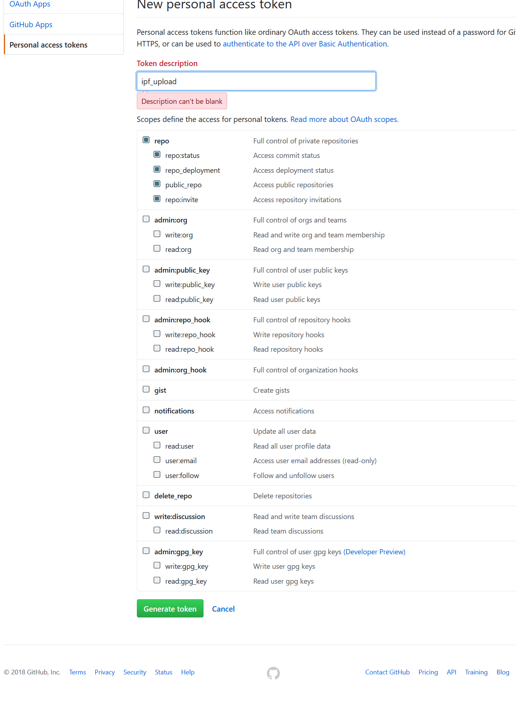

# IPF-Auto-Relase
これはgitのHook機能を使い、addons.jsonが更新されたときに自動でフォルダをIPF化しGithub Releasにアップロードするものです
いくつか依存関係やフォルダ構造の制限があるため、それを許容できる場合に使用してください。

## フォルダ構造
### IPF化するフォルダが一つの場合
Tos-Addonというリポジトリで管理していて、AutoReleaseというアドオン作っている場合は
```
Tos-Addon
  └AutoRelease
     │─README.md
     └─autorelease (or src)
        └─autorelase.lua
        └─autorelase.xml
```
というファイル構造になります  
この時のaddons.jsonには以下のようになります
```
{
    "name" : "AutoRelease",
    "file" : "autorelase",
    "extension" : "ipf",
    "fileVersion" : "v1.0.0",
    "releaseTag" : "autorelase",
    "unicode" : "⛄",
    "description" : "",
    "updateInfo" :"",
    "tags" : [
        "ui"
    ]
}
```
lua,xmlの名前をaddons.jsonのfileの値と同じにしてください  
fileの値.luaというファイルを検索し、その一つ前のフォルダをコピー、パックし削除するため、luaの一つ前のフォルダ名は割とどうでもいいです  


### IPF化するフォルダが複数ある場合
```
Tos-Addon
  └AutoRelease
     │─README.md
     └─src
        └─autorelase
        │ └─autorelase.lua
        │ └─autorelase.xml
        │
        └─autorelase2
          └─autorelase2.lua
          └─autorelase2.xml
```
`src`フォルダの中それぞれのフォルダ作成し、lua,xmlを作成してください(名前は同一のものをつける)  
今回の場合はautoreleaseフォルダの下にautorelease.luaがあり、autorelease2フォルダの下にautorelease2.luaがあるといった形です


## 依存関係
* [tpIpfTool](https://github.com/kuronekotei/IpfTool/releases)
* [ghr](https://github.com/tcnksm/ghr/releases)
* [node.js](https://nodejs.org/ja/)

が必要になります
tpIpfToolおよびghrに関しては上記リンクにバイナリが公開されているので、パスが通っているフォルダに放り込んでください  
node.jsはなるべく最新のバージョンを適当にインストールしておいてください

## 使い方
まずはGithub Releaseに放り込むために、トークンを取得します  
[このリンク](https://github.com/settings/tokens)から新しいトークンを作成します  
適当な名前とrepoにチェックを入れて作成してください  
  
この後トークンが生成されるのでコピーし、git configのgithub.tokenにセットします  
`git config --global github.token "....."`

あとは、このリポジトリのpost-commitをダウンロードし、アドオンを管理しているフォルダに  
`.git/hook/post-commit`  
となるようにpost-commitを移動させてください  

addons.jsonが更新し、コミットした時に処理が走り、自動でRelease生成とファイルのアップロードが始まります  
